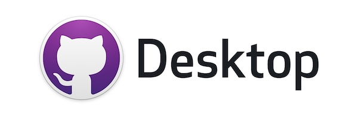
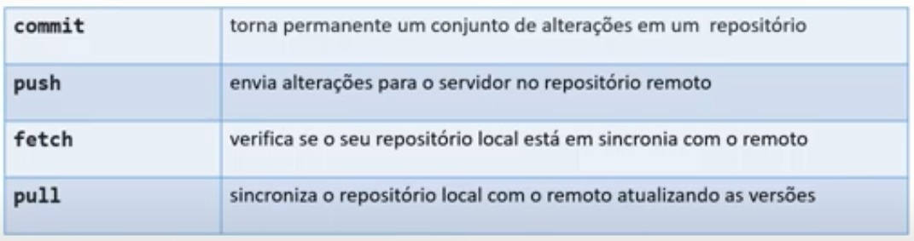

# RDE06-Guilherme_Recofka
<!DOCTYPE html>
<html lang="pt-BR">
<head>
    <meta charset="UTF-8">
    <meta http-equiv="X-UA-Compatible" content="IE=edge">
    <meta name="viewport" content="width=device-width, initial-scale=1.0">
    <link rel="icon" href="img/espiral.png" type="image/x-icon">
    <title>RDE06 - SÍNTESE</title>
</head>
<body>
    <h1>Software de Versionamento</h1>
    
<i><b>Observação incicial:</b> Eu tentei resumir o maximo que eu conseguia, essas são as semanas próximas do vestibular (PSS II - UEPG) e quero ver se da tempo de estudar umas coisas acumuladas. Espero que o professor entenda.</i>

    <h1>Sofware de Controle de Versão</color></h1>
    
Os sistemas de controle de versão são ferramentas de software que ajudam as equipes de software a gerenciar as alterações ao código-fonte ao longo do tempo. Como os ambientes de desenvolvimento aceleraram, os sistemas de controle de versão ajudam as equipes de software a trabalhar de forma mais rápida e inteligente.

    <h1>Tipos Sofware de Controle de Versão</color></h1>
    
<h1>Centralizado</h1>

        

           <ol> 
                <li>Possui um <b>repositório central em um servidor</b> com controle de versões;</li>
                <li><b>Dependente</b> do servidor;</li>
                <li><i>Software Subversion.</i></li>
            </ol>
        

    
<h1>Distribuído</h1>

        

           <ol> 
                <li>Possui um <b>repositório local</b> com controle de versões;</li>
                <li>Atualizações no repositório central;</li>
                <li><b>Independente</b> do servidor;</li>
                <li><i>Softwares Mercurial, Git.</i></li>
            </ol>
        

    <h1>Git</color></h1>
        
<figure></figure>

    
Sistema de controle de versões distribuído, usado principalmente no desenvolvimento de software, mas pode ser usado para registrar o histórico de edições de qualquer tipo de arquivo

    <h1>Github</color></h1>
        
<figure></figure>

    
plataforma de hospedagem de código-fonte e arquivos com controle de versão usando o Git. Ele permite que programadores, utilitários ou qualquer usuário cadastrado na plataforma contribuam em projetos privados e/ou Open Source de qualquer lugar do mundo.

    <h1>Desktop Github</color></h1>
        
<figure></figure>

    
Um aplicativo que permite que você interaja com o GitHub usando uma GUI em vez da linha de comando ou de um navegador web.

    <h1>Visual Studio Code</color></h1>
        
<figure></figure>

    
Um editor de código de código aberto desenvolvido pela Microsoft.

    <h1>Comandos GIT</color></h1>
        
<figure></figure>

</body>
</html>
